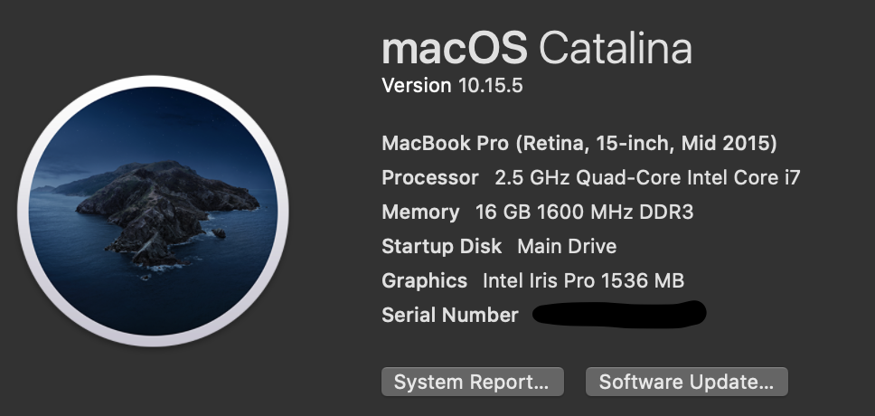

# Computer Pointer Controller

This project is an application that controls the computer pointer to follow human eye gaze direction. This project is build with OpenVINO toolkit and 4 pretrain models, which are [Face Detection Model](https://docs.openvinotoolkit.org/latest/_models_intel_face_detection_adas_binary_0001_description_face_detection_adas_binary_0001.html), [Facial Landmarks Detection Model](https://docs.openvinotoolkit.org/latest/_models_intel_landmarks_regression_retail_0009_description_landmarks_regression_retail_0009.html), [Head Pose Estimation Model](https://docs.openvinotoolkit.org/latest/_models_intel_head_pose_estimation_adas_0001_description_head_pose_estimation_adas_0001.html), and [Gaze Estimation Model](https://docs.openvinotoolkit.org/latest/_models_intel_gaze_estimation_adas_0002_description_gaze_estimation_adas_0002.html).

## Project Set Up and Installation
1. Install [Intel OpenVINO toolkit](https://docs.openvinotoolkit.org/latest/index.html) 
2. Install 4 pretrained models for this project.
	1. Open Terminal in your device
	2. cd into the project folder you downloaded 
	3. Initialize the openVINO environment
    	```
    	source /opt/intel/openvino/bin/setupvars.sh
    	```
	4. Install 4 pretrained models by running these code
    	```
    	sudo python3 /opt/intel/openvino/deployment_tools/tools/model_downloader/downloader.py --name "face-detection-adas-binary-0001"
        ```
        ```
    	sudo python3 /opt/intel/openvino/deployment_tools/tools/model_downloader/downloader.py --name "landmarks-regression-retail-0009"
        ```
        ```
    	sudo python3 /opt/intel/openvino/deployment_tools/tools/model_downloader/downloader.py --name "head-pose-estimation-adas-0001"
        ```
        ```
    	sudo python3 /opt/intel/openvino/deployment_tools/tools/model_downloader/downloader.py --name "gaze-estimation-adas-0002"
    	```
	5. Install requirements package for this project
    	```
    	sudo pip3 install -r requirements.txt
    	```
## Project Structure 
```
├── LICENSE
├── README.md
├── bin
│   └── demo.mp4
├── face_detection.py
├── facial_landmarks_detection.py
├── gaze_estimation.py
├── head_pose_estimation.py
├── img
│   └── Screen\ Shot\ 2020-07-20\ at\ 7.02.24\ PM.png
├── input_feeder.py
├── intel
│   ├── face-detection-adas-binary-0001
│   │   └── FP32-INT1
│   │       ├── face-detection-adas-binary-0001.bin
│   │       └── face-detection-adas-binary-0001.xml
│   ├── gaze-estimation-adas-0002
│   │   ├── FP16
│   │   │   ├── gaze-estimation-adas-0002.bin
│   │   │   └── gaze-estimation-adas-0002.xml
│   │   ├── FP32
│   │   │   ├── gaze-estimation-adas-0002.bin
│   │   │   └── gaze-estimation-adas-0002.xml
│   │   └── FP32-INT8
│   │       ├── gaze-estimation-adas-0002.bin
│   │       └── gaze-estimation-adas-0002.xml
│   ├── head-pose-estimation-adas-0001
│   │   ├── FP16
│   │   │   ├── head-pose-estimation-adas-0001.bin
│   │   │   └── head-pose-estimation-adas-0001.xml
│   │   ├── FP32
│   │   │   ├── head-pose-estimation-adas-0001.bin
│   │   │   └── head-pose-estimation-adas-0001.xml
│   │   └── FP32-INT8
│   │       ├── head-pose-estimation-adas-0001.bin
│   │       └── head-pose-estimation-adas-0001.xml
│   └── landmarks-regression-retail-0009
│       ├── FP16
│       │   ├── landmarks-regression-retail-0009.bin
│       │   └── landmarks-regression-retail-0009.xml
│       ├── FP32
│       │   ├── landmarks-regression-retail-0009.bin
│       │   └── landmarks-regression-retail-0009.xml
│       └── FP32-INT8
│           ├── landmarks-regression-retail-0009.bin
│           └── landmarks-regression-retail-0009.xml
├── main.py
├── mouse_controller.py
└── requirements.txt
```

## Demo
Use the below code to run this project
```
python3 main.py -f intel/face-detection-adas-binary-0001/FP32-INT1/face-detection-adas-binary-0001.xml -fl intel/landmarks-regression-retail-0009/FP32/landmarks-regression-retail-0009.xml -hp intel/head-pose-estimation-adas-0001/FP32/head-pose-estimation-adas-0001.xml -g intel/gaze-estimation-adas-0002/FP32/gaze-estimation-adas-0002.xml -i bin/demo.mp4
```

## Documentation
Use this help function in main.py to find more details
```
python3 main.py -h
```
```
usage: main.py [-h] -f FACEDETECTIONMODEL -fl FACIALLANDMARKMODEL -hp
               HEADPOSEMODEL -g GAZEESTIMATIONMODEL -i INPUT
               [-flags PREVIEWFLAGS [PREVIEWFLAGS ...]] [-l CPU_EXTENSION]
               [-prob PROB_THRESHOLD] [-d DEVICE]

optional arguments:
  -h, --help            show this help message and exit
  -f FACEDETECTIONMODEL, --facedetectionmodel FACEDETECTIONMODEL
                        Path to .xml file of Face Detection model.
  -fl FACIALLANDMARKMODEL, --faciallandmarkmodel FACIALLANDMARKMODEL
                        Path to .xml file of Facial Landmark Detection model.
  -hp HEADPOSEMODEL, --headposemodel HEADPOSEMODEL
                        Specify path to .xml file of Head Pose Estimation
                        model.
  -g GAZEESTIMATIONMODEL, --gazeestimationmodel GAZEESTIMATIONMODEL
                        Specify path to .xml file of Gaze Estimation model.
  -i INPUT, --input INPUT
                        Specify path to video file or enter cam for webcam
  -flags PREVIEWFLAGS [PREVIEWFLAGS ...], --previewFlags PREVIEWFLAGS [PREVIEWFLAGS ...]
                        Specify the flags from fd, fld, hp, ge like --flags fd
                        hp fld (Seperated by space)for see the visualization
                        of different model outputs of each frame,fd for Face
                        Detection, fld for Facial Landmark Detectionhp for
                        Head Pose Estimation, ge for Gaze Estimation.
  -l CPU_EXTENSION, --cpu_extension CPU_EXTENSION
                        path of extensions if any layers is incompatible with
                        hardware
  -prob PROB_THRESHOLD, --prob_threshold PROB_THRESHOLD
                        Probability threshold for model to detect the face
                        accurately.
  -d DEVICE, --device DEVICE
                        Specify the target device to run on: CPU, GPU, FPGA or
                        MYRIAD is acceptable. Sample will look for a suitable
                        plugin for device (CPU by default)
```

## Benchmarks
Project ran on my MacBook Pro 2015 with below hardware
[](Image)

The results are below
* FP32:
The total model loading time is : 0.873162sec
The total inference time is : 1.185551sec
The FPS is : 9.783141fps

* FP16:
The total model loading time is : 0.85821sec
The total inference time is : 1.086544sec
The FPS is : 10.031417fps

* INT8:
The total model loading time is : 0.894013sec
The total inference time is : 1.023654sec
The FPS is : 10.251935fps

## Results
Model with lower precision will have faster inference time but have lower accuracy. This might because lower precision model use less memory of the computer and use less processing power of the computer

## Stand Out Suggestions
I tried different precision FP32, FP16, and INT8 to find a way to improve inference time and accuracy.

### Edge Cases
1. Lighting changes
We will need to make sure the eye is still detectable under this lighting, otherwise we will need to use computer to lower it's brightness.
2. Multiple people in the frame
We will need to have an option to select the person to run the project, or we can add facial recognition to the project.
